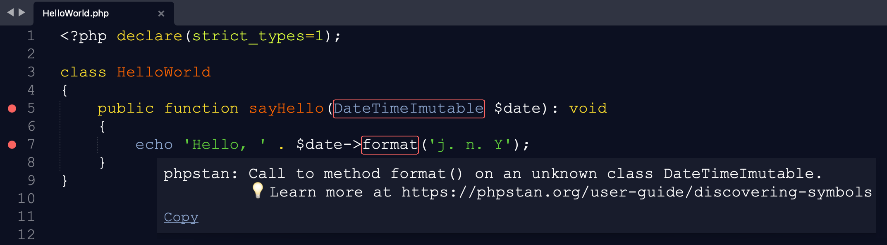

SublimeLinter-contrib-phpstan
================================

This linter plugin for [SublimeLinter](https://github.com/SublimeLinter/SublimeLinter) provides an interface to [PHPStan](https://github.com/phpstan/phpstan).
The code analysis is executed on the edited file when it is saved.



## Installation
SublimeLinter must be installed in order to use this plugin.

Please use [Package Control](https://packagecontrol.io) to install the linter plugin.
Alternatively, you can clone this repository into your Sublime Text `Packages` directory as follow:

```bash
cd ~/Library/Application Support/Sublime Text/Packages
git clone https://github.com/Rockstar04/SublimeLinter-contrib-phpstan
```

By default, this plugin uses PHPStan from `vendor/bin`. Otherwise, it will fall back to a global `phpstan` executable (in that case, you must ensure that its path is available to SublimeLinter, see [troubleshooting PATH configuration](http://sublimelinter.readthedocs.io/en/latest/troubleshooting.html#finding-a-linter-executable)).

## Settings
- SublimeLinter settings: http://sublimelinter.readthedocs.org/en/latest/settings.html
- Linter settings: http://sublimelinter.readthedocs.org/en/latest/linter_settings.html

## Debugging
If you encounter a problem, you can enable debug mode to see what's going on by simply adding `"debug": true` to your SublimeLinter settings.
You can then view the debug messages in the Sublime Text console by going to <kbd>View</kbd> > <kbd>Show Console</kbd>.
